# Fractal Collection

A collection of Fractals that i made in Unity using image effects (game window as canvas).

Developed between October 2017 and February 2018. I didn't have WiFi during that period, hence the file dump.

It includes:

	Complex Number operations
	9 Different Mandelbrot Rendering Techniques
	Basic Fractal Types
	Animated fractal shaders
	Custom ShaderGUI to export images from pixel shaders in Unity

Need help with the algorithms? Shoot me an email!

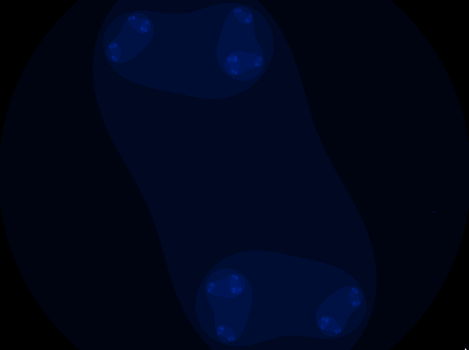

# Includes

The following fractals are included:

	Mandelbrot   
	Multibrot 
	Julia
	Multijulia
	Burning Ship
	Tricorn
	Barnsley Fractal
	Magnet Fractal
	Newton Fractal w/ Transformation Vector

Custom Fractals:

	Burning Julia
	Conjulia

Rendering Techniques:

	Escape-Time
	Smooth
	Lyapunov Exponent
	Orbit Trap
	Pickover Stalk
	Edge Detection
	Normal Mapped
	Hue
	Cheap Interior Distance Estimation

# Extra

I found a lack of pseudocode on wikipedia. The only article that i found that had some was the Mandelbrot Set, so i decided to add pseudocode of my own based on my implementations.

I added it for the following articles:
    
* [Tricorn](https://en.wikipedia.org/w/index.php?title=Tricorn_(mathematics))
* [Burning Ship](https://en.wikipedia.org/wiki/Burning_Ship_fractal)

* [Julia](https://en.wikipedia.org/wiki/Julia_set)
	
* [Pickover Stalk](url)

* [Newton Fractal](url)

# Examples

Here are some pictures of the fractals plotted with this library:

Julia

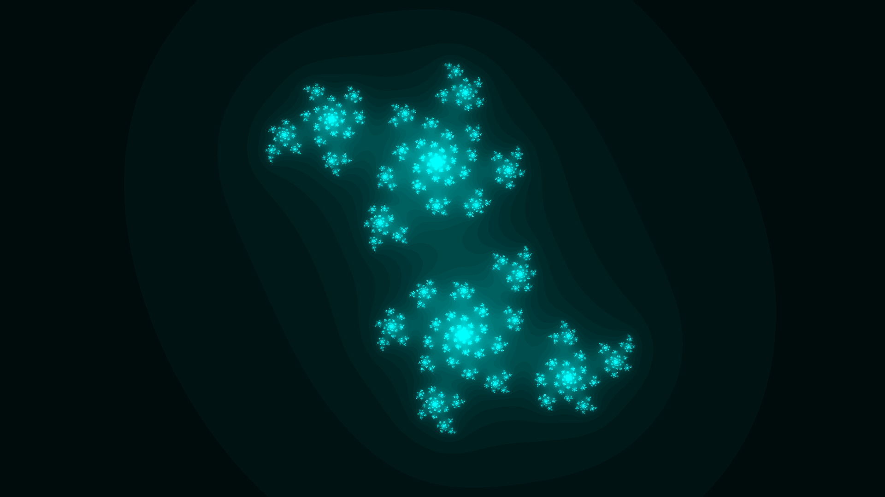

Tricorn

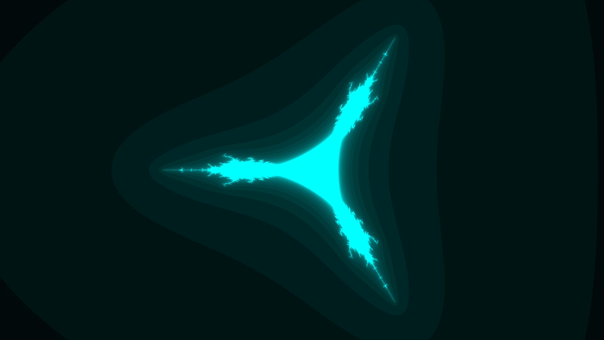

Burning Ship

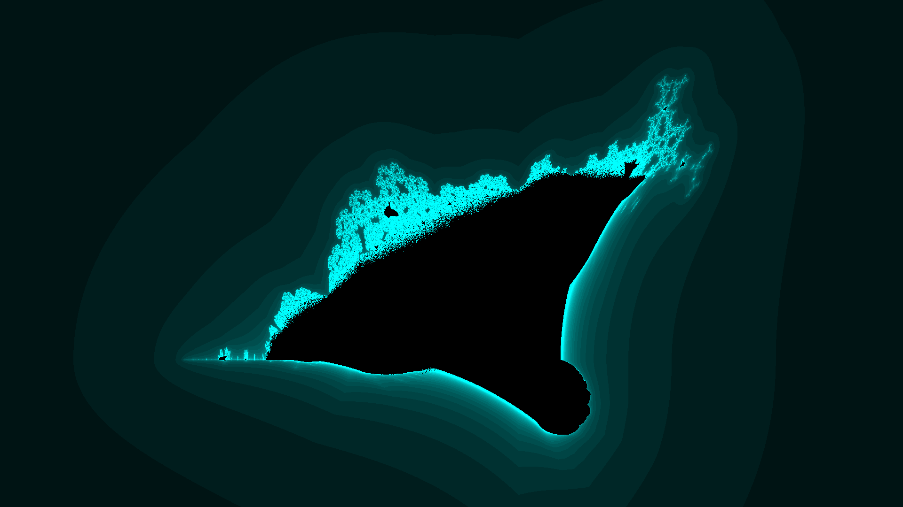

Conjulia

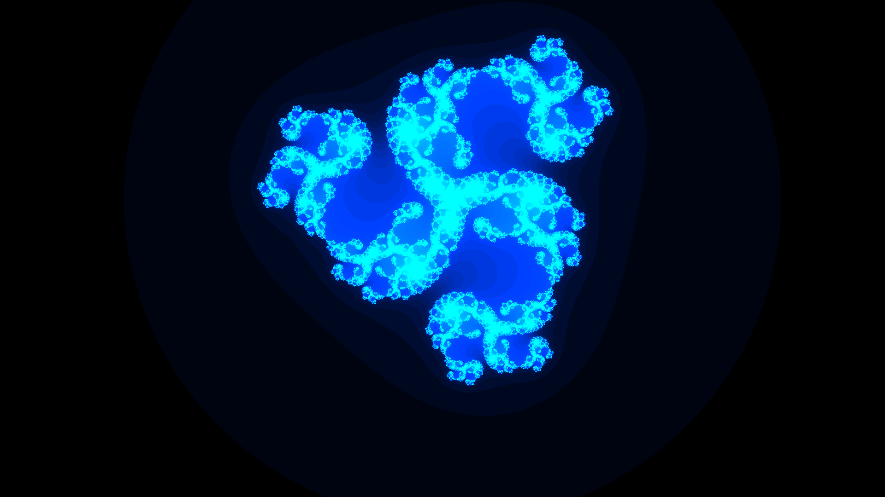

Magnet

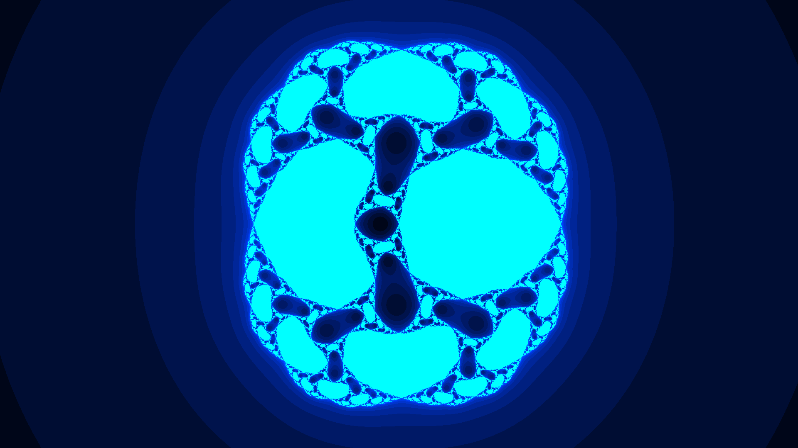

Barnsley

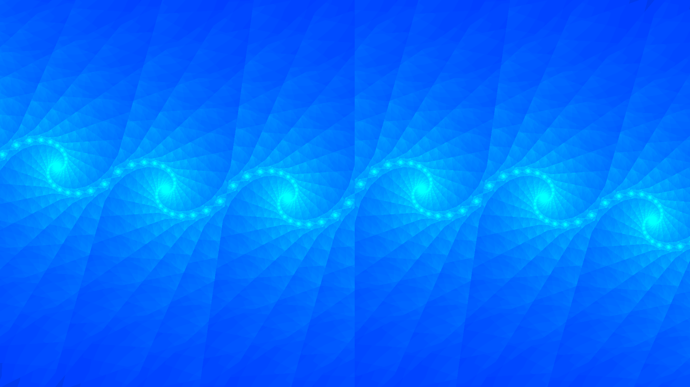

Coloring Methods:

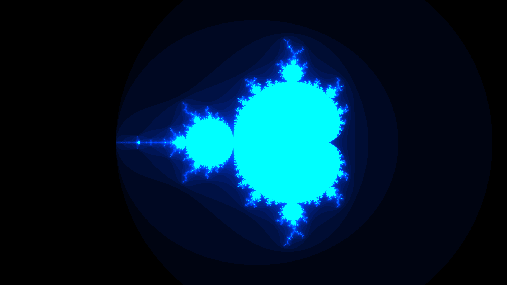

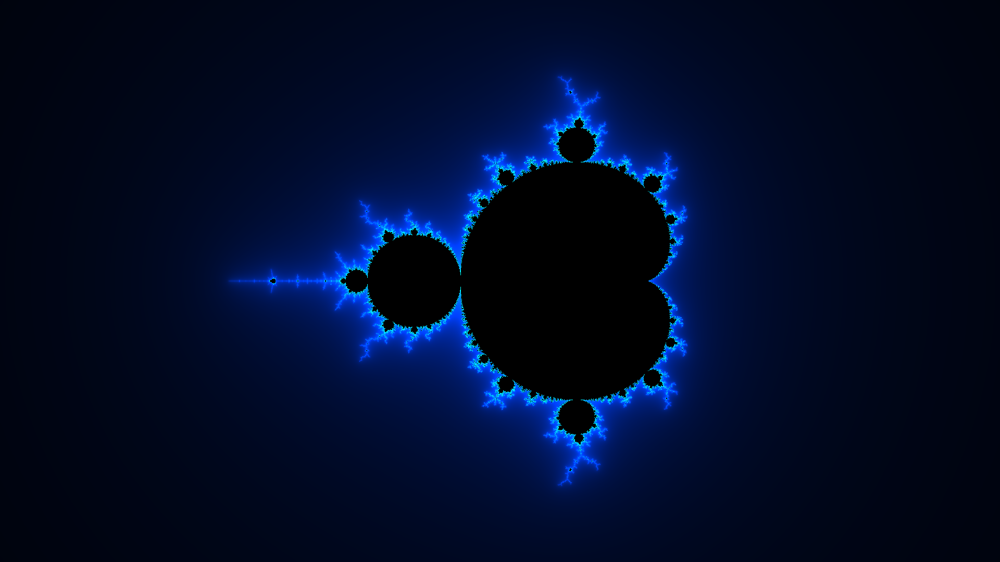

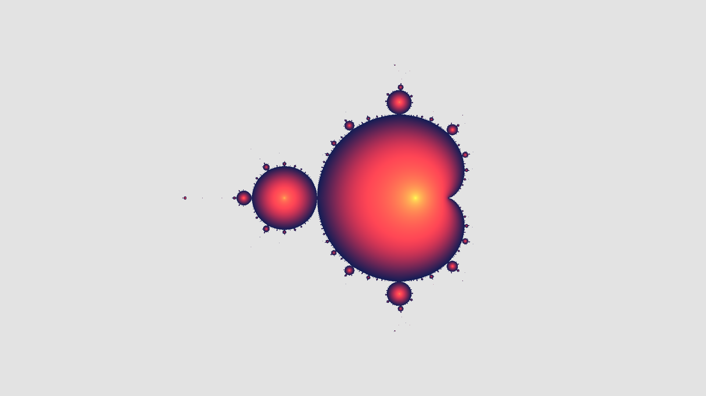

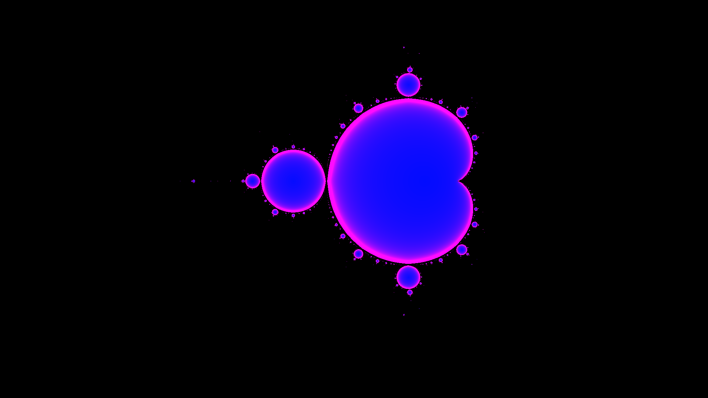

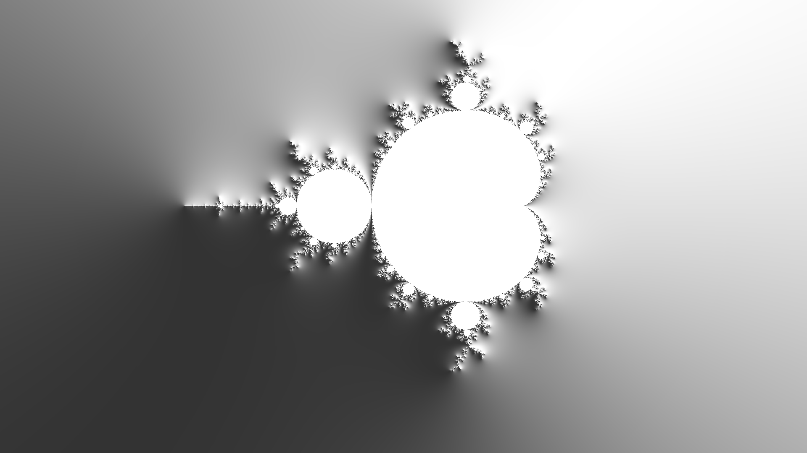

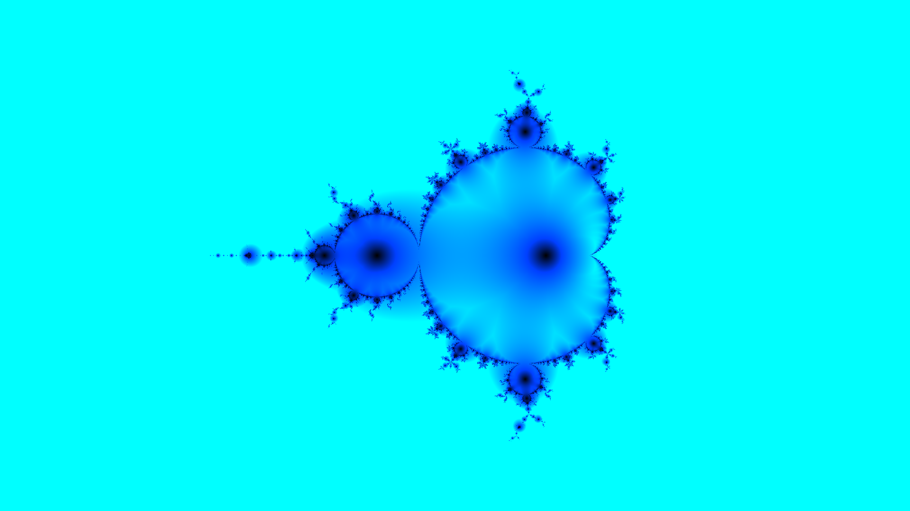

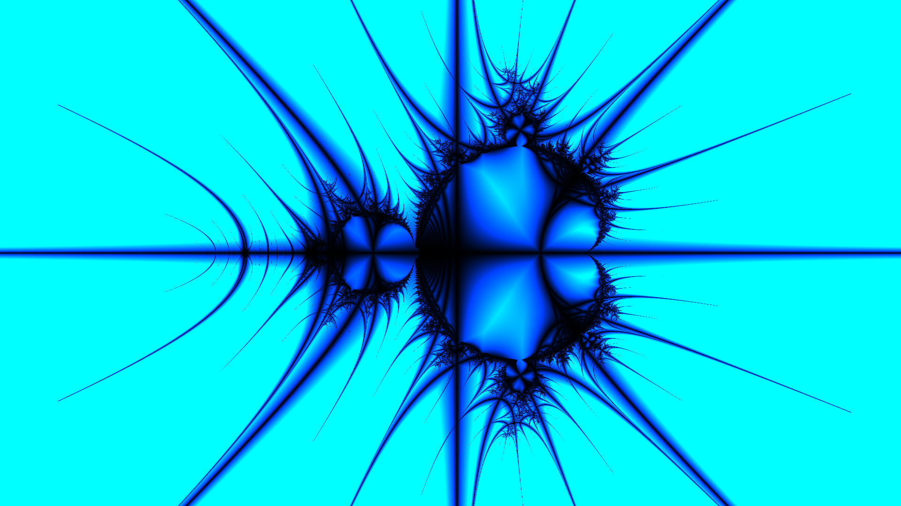

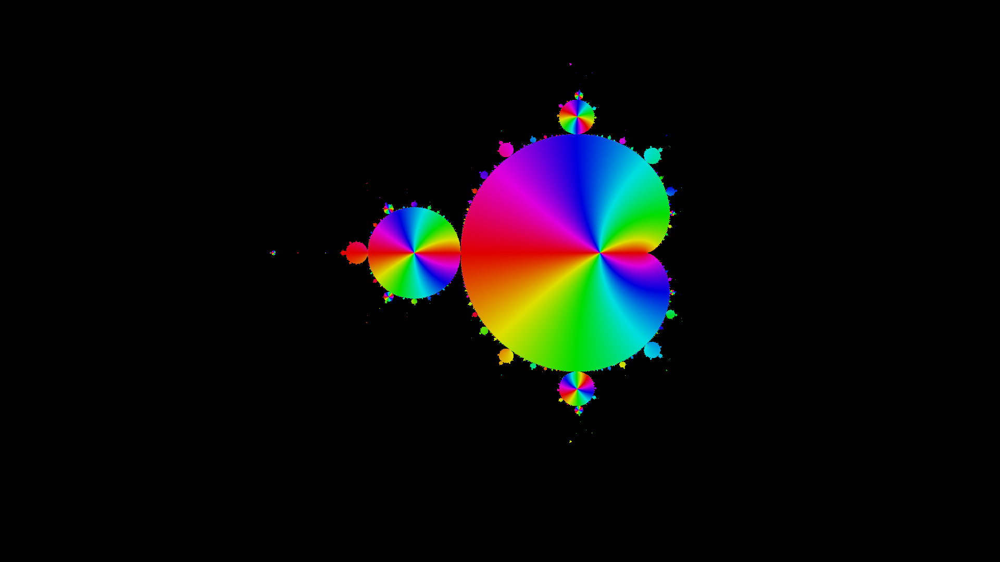

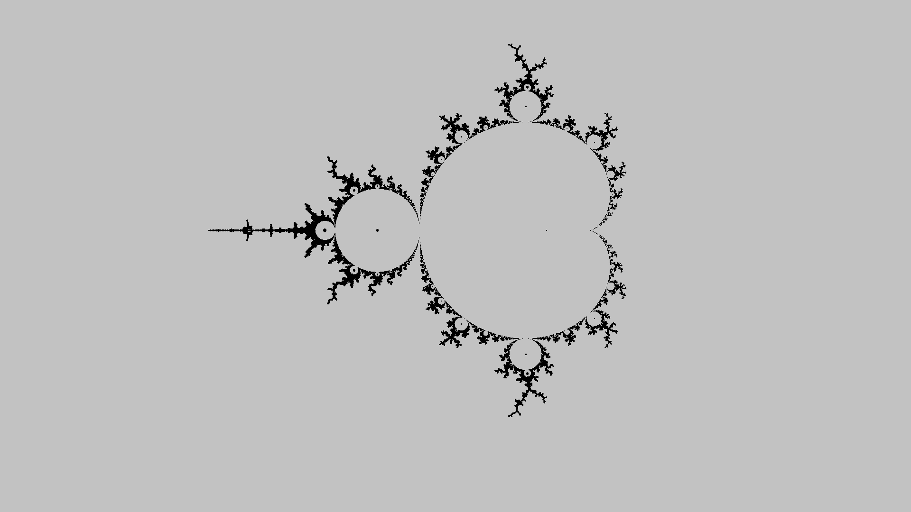

# Consider buying me a coffee if you like my work (click the image)

